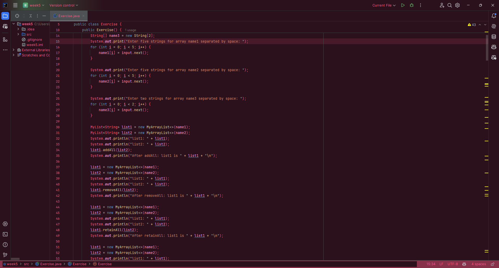

# Pink Functional JetBrains Theme

A simple pink theme, with syntax highlighting kept as normal as possible to not hinder your DX!

Based on ["Pink as Heck" by shoobah](https://marketplace.visualstudio.com/items?itemName=shoobah.pinkasheck).

Because good token highlighting is important, I changed the Theme in a way where these colors stay very familiar. Completely pink everything looks nice but it's not usable, so this is a nice compromize!

